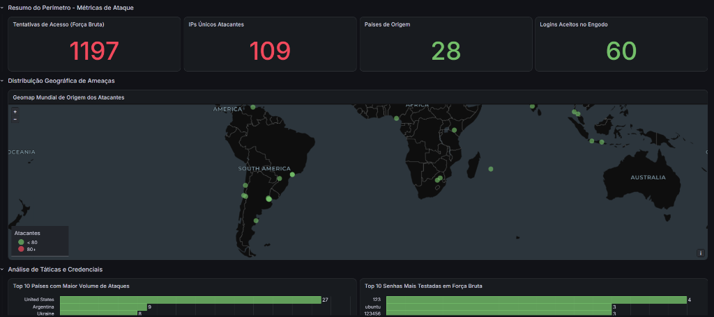

# AWS Cowrie Honeypot - Pipeline de Threat Intelligence e Observabilidade

Este projeto implementa um laboratório completo de Engenharia de Detecção, Threat Intelligence e Observabilidade na nuvem AWS. O ambiente expõe intencionalmente uma porta SSH de engodo (Honeypot Cowrie) para capturar varreduras, ataques de forca bruta e tentativas de intrusão da internet publica, processando esses eventos em um pipeline serverless e exibindo a telemetria em tempo quase real (near real-time) no Grafana Cloud.

---

## 1. Arquitetura da Solucao

A solucao e dividida em cinco camadas desacopladas e orientadas a eventos:

```text
[ Internet / Scanners / Atacantes ]
       │
       ▼ (Porta TCP/22)
[ Host EC2 (t3.micro - Ubuntu 24.04 LTS) ]
  • Cowrie Honeypot isolado em container Docker
  • Daemon OpenSSH real movido para porta administrativa TCP/22022
  • Script de sincronizacao periódica (cronjob) com controle de cursor
       │
       ▼ (Upload periódico de logs brutos)
[ Amazon S3 (Bucket Privado com Criptografia SSE-S3) ]
  • Prefixo: cowrie-logs/year=YYYY/month=MM/day=DD/
  • Lifecycle Rule: expiracao automatica em 30 dias
       │
       ▼ (Evento nativo: s3:ObjectCreated:*)
[ AWS Lambda (Runtime Python 3.12) ]
  • Parser dos eventos brutos do Cowrie (conexoes, logins, comandos, downloads)
  • Agregacao e desduplicacao de atacantes por lote
  • Enriquecimento GeoIP (Pais, Cidade, Latitude, Longitude, ISP)
  • Enriquecimento de Reputacao (AbuseIPDB API)
  • Alerta condicional via Webhook do Discord (em caso de invasao confirmada)
       │
       ▼ (Gravacao estruturada em JSON Lines)
[ Amazon S3 (Telemetria Enriquecida) ]
  • Prefixo: enriched-telemetry/
       │
       ▼ (Consultas SQL sob demanda)
[ AWS Glue Data Catalog & Amazon Athena ]
  • Banco de Dados: cowrie_threat_intel
  • Tabela Externa: enriched_attacks (OpenX JsonSerDe)
  • Workgroup de FinOps: cowrie_analytics (trava de corte de 100 MB por query)
       │
       ▼ (Autenticacao IAM com Menor Privilegio)
[ Grafana Cloud (SOC Dashboard) ]
  • Geomap Mundial interativo com distribuicao geografica dos atacantes
  • Metricas executivas de forca bruta e comprometimento
  • Ranking das credenciais mais visadas (Top Senhas e Usuarios)
  • Tabela forense cronologica de comandos executados
```

---

## 2. Dashboard SOC ao Vivo (Grafana Cloud)

O ambiente conta com um painel de monitoramento publicado no Grafana Cloud, permitindo a visualizacao publica e segura dos incidentes capturados pelo honeypot:

* **Link Publico do Dashboard:** [https://greengoose3572.grafana.net/public-dashboards/e4a92d5e603c43398ffe69c190c9af4f](https://greengoose3572.grafana.net/public-dashboards/e4a92d5e603c43398ffe69c190c9af4f)



### Paineis e Metricas Visualizadas:
1. **Tentativas de Acesso (Forca Bruta):** Total consolidado de tentativas de autenticacao SSH realizadas contra o endpoint (mais de 1.100 eventos agregados de um total de 7.200 interacoes brutas).
2. **IPs Unicos Atacantes:** Contagem de enderecos IP distintos que dispararam varreduras e tentativas de intrusao (109 atacantes unicos mapeados).
3. **Paises de Origem:** Dispersao geografica dos vetores de ataque, abrangendo 28 paises (principais origens: China, Estados Unidos, Russia, Coreia do Sul, Brasil, entre outros).
4. **Logins Aceitos no Engodo:** Sessoes onde credenciais fracas configuradas intencionalmente permitiram o acesso do invasor ao shell simulado para captura de comportamento forense (60 acessos monitorados).
5. **Geomap Mundial de Origem dos Atacantes:** Visualizacao cartografica interativa em mapa CartoDB Dark, plotando marcadores geograficos de acordo com a latitude, longitude e volume de tentativas de cada atacante.
6. **Top 10 Paises com Maior Volume de Ataques:** Grafico de barras horizontais rankeando os paises com maior frequencia de requisicoes ofensivas.
7. **Top 10 Senhas Mais Testadas em Forca Bruta:** Mineracao forense das credenciais mais utilizadas em ataques de dicionario (destaque para senhas padrao como `root`, `123456`, `admin`, `password`).
8. **Historico de Comandos Executados:** Tabela cronologica de telemetria forense registrando comandos digitados pelos invasores durante sessoes ativas no honeypot (como tentativas de download de scripts maliciosos, comandos de reconhecimento como `uname -a`, `cat /proc/cpuinfo`, `id`, `whoami`).

---

## 3. Mineracao e Enriquecimento de Dados (ETL de Threat Intelligence)

Os arquivos brutos gerados pelo Cowrie (`cowrie.json`) contem apenas eventos atomicos com enderecos IP de origem. Para viabilizar a analise visual no Grafana, o motor da Lambda executa um processo de mineracao e enriquecimento estruturado:

1. **Extracao e Desduplicacao:**
   * Agrupa centenas de tentativas de forca bruta provenientes do mesmo IP em uma unica entidade analitica por lote.
   * Compila listas unicas de usuarios tentados, senhas testadas, comandos executados no shell simulado e arquivos baixados/injetados.

2. **Resolucao Geografica (GeoIP):**
   * Converte cada endereco IP publico em metadados geograficos precisos: codigo do pais (ISO-3166), nome do pais, cidade, latitude e longitude decimais.
   * Mapeia a organizacao ou provedor de internet (ISP/ASN) responsavel pelo bloco de rede do invasor.

3. **Reputacao de Ameacas (AbuseIPDB):**
   * Consulta a API do AbuseIPDB para obter o `abuseConfidenceScore` (probabilidade de 0 a 100% de o IP ser um vetor malicioso ativo), historico de denuncias internacionais e classificacao de lista branca.

4. **Persistencia Colunar em JSON Lines:**
   * Grava os dados tratados no formato JSON Lines (um documento JSON valido por linha) compativel com o SerDe do Athena, permitindo consultas analiticas velozes sem exigir manutencao de bancos relacionais tradicionais.

---

## 4. Funcionamento Near Real-Time e Otimizacao de Custos (FinOps)

O pipeline opera no modelo **Near Real-Time** (tempo quase real com micro-lotes):

* **Cadencia da Coleta:** A cada intervalo programado (ex: 5 minutos), o script de sincronizacao no host envia apenas os novos registros gerados pelo Cowrie para o S3.
* **Gatilho Instantaneo:** O evento `s3:ObjectCreated` aciona a Lambda em fracao de segundo, processando e disponibilizando os dados no Athena imediatamente.
* **Cadencia do Grafana:** O dashboard no Grafana Cloud esta configurado com taxa de atualizacao automatica de **1 hora** (com possibilidade de atualizacao manual sob demanda pelo botao Refresh).

### Vantagens dessa Abordagem:
* **Reducao de Custos de 92%:** Atualizar de 1 em 1 hora reduz as execucoes de query no Athena de 1.728 para 144 por dia caso o painel permaneca aberto, mantendo o custo mensal do Athena abaixo de US$ 0,001.
* **Preservacao de Cotas de API:** Processar em lotes agregados impede que ataques macicos de forca bruta esgotem o limite gratuito diario de consultas da API do AbuseIPDB.

---

## 5. Seguranca da Infraestrutura e Menor Privilegio (IAM)

O ambiente foi construido seguindo padroes rigorosos de seguranca de nuvem:

* **Isolamento de Rede (VPC Dedicada):** O laboratório opera em uma VPC propria (`10.0.0.0/24`), sem comunicacao com outros servicos ou VPCs da conta.
* **Firewall de Saida Restritivo (Egress Filtering):** O Security Group bloqueia saidas irrestritas da EC2. Apenas portas estritamente necessarias (TCP/443 para APIs da AWS, TCP/80 para repositorios e UDP/TCP 53 para DNS) sao permitidas. Isso impede que o invasor utilize o servidor comprometido como no de saida para ataques de negacao de servico (DDoS) ou envio de spam.
* **Isolamento de Portas SSH:**
  * Porta TCP/22: Redirecionada para o container Docker do Cowrie (aberta ao mundo `0.0.0.0/0`).
  * Porta TCP/22022: Porta real do sistema operacional Ubuntu (restrita exclusivamente ao IP do administrador).
* **IAM de Menor Privilegio:**
  * **Role da EC2:** Permite apenas `s3:PutObject` em `cowrie-logs/*`. A maquina nao tem permissao de leitura, listagem ampla ou exclusao.
  * **Role da Lambda:** Permite apenas leitura dos logs brutos, escrita na pasta de telemetria enriquecida e logs no CloudWatch.
  * **Usuario do Grafana (`cowrie-grafana-reader`):** Permissao restrita exclusivamente a execucao de consultas no Athena e leitura dos resultados no S3. Nao possui privilegios administrativos, de alteracao de regras ou de exclusao de dados.
* **Disjuntor Financeiro do Athena:** O Workgroup `cowrie_analytics` impoe um teto maximo de **100 MB escaneados por consulta** (`BytesScannedCutoffPerQuery`). Se uma consulta ultrapassar esse limite, ela e abortada automaticamente pela AWS.
* **Higienizacao de Segredos:** O arquivo `.gitignore` bloqueia chaves `.pem`, credenciais `.tfvars` e arquivos de estado, impedindo o envio acidental de dados sensiveis para o controle de versao.

---

## 6. Estrutura do Repositorio

```plaintext
aws-honeypot-threat-intel/
├── PROJECT_SPEC.md              # Especificacoes e premissas do projeto
├── README.md                    # Documentacao tecnica da arquitetura
├── .gitignore                   # Politicas de exclusao de credenciais e chaves
├── docs/
│   └── images/
│       └── grafana_soc_dashboard.png # Captura de tela do SOC Dashboard no Grafana Cloud
├── terraform/                   # Infraestrutura como Codigo (IaC)
│   ├── main.tf                  # Versoes e provedor AWS
│   ├── variables.tf             # Parametros de rede, portas e chaves
│   ├── vpc.tf                   # VPC isolada, subnet publica e internet gateway
│   ├── security_groups.tf       # Regras restritivas de ingress e egress
│   ├── s3.tf                    # Bucket de logs, bloqueio publico e lifecycle
│   ├── ec2.tf                   # Host t3.micro e script de inicializacao (User Data)
│   ├── lambda.tf                # Provisionamento da Lambda e triggers do S3
│   ├── athena.tf                # Banco Glue, Workgroup FinOps e tabela externa
│   ├── grafana_iam.tf           # Usuario IAM e credenciais para o Grafana Cloud
│   └── outputs.tf               # Dados de conexao exportados
├── lambda/
│   └── handler.py               # Motor Python de parser, GeoIP e AbuseIPDB
├── grafana/
│   └── honeypot_soc_dashboard.json # Modelo exportavel do Dashboard SOC com datasource vinculada
├── scripts/
│   ├── backfill_enrichment.py   # Script de mineracao e carga inicial historica
│   ├── sync_logs_to_s3.sh       # Script de sincronizacao periodica na EC2
│   └── test_lambda_local.py     # Script de validacao local do parser
└── tests/                       # Suite automatizada de testes (Pytest)
    ├── conftest.py              # Fixtures e configuracoes de teste
    ├── test_unit_lambda_parser.py # Testes unitarios do parser e GeoIP
    ├── test_unit_threat_intel.py # Testes de resiliencia do AbuseIPDB e alertas
    ├── test_integration_s3_athena.py # Testes de integracao com Athena e Glue
    └── test_security_compliance.py # Testes de compliance, IAM e FinOps
```

---

## 7. Cobertura de Testes Automatizados

O repositorio conta com uma suite de testes automatizados com 100% de aprovacao utilizando o framework `pytest`:

```bash
pytest -v tests/
```

### Escopo dos Testes:
* **Validacao de FinOps:** Comprova via AWS SDK que a trava de 100 MB do Athena esta ativa.
* **Integridade do Glue Catalog:** Valida os tipos de dados e a existencia das colunas requeridas pelo Grafana.
* **Execucao de Queries SQL:** Executa consultas analiticas reais no Athena e valida o formato das respostas.
* **Resiliencia de Parser:** Testa a extracao com logs truncados, caracteres invalidos e enderecos IP locais.
* **Conformidade de Seguranca:** Audita as politicas IAM para garantir a ausencia de permissoes de exclusao ou administrativas indevidas.

---

## 8. Como Importar e Compartilhar o Dashboard no Grafana Cloud

### Importacao do Painel:
1. No Grafana Cloud, acesse **Dashboards** > **New** > **Import**.
2. Abra o arquivo [`grafana/honeypot_soc_dashboard.json`](grafana/honeypot_soc_dashboard.json), copie o conteudo e cole na caixa de texto.
3. Clique em **Load**, selecione a sua data source do Amazon Athena e conclua a importacao.

### Como Disponibilizar o Dashboard Publicamente na Internet:
O Grafana Cloud possui o recurso nativo **Public Dashboards**, que permite gerar um link publico de visualizacao interativa segura sem expor credenciais ou exigir login dos visitantes:

1. Abra o dashboard no Grafana Cloud.
2. Clique no icone de **Compartilhar** (Share) no canto superior direito.
3. Selecione a aba **Public dashboard**.
4. Clique em **Generate public URL** e ative a opcao.
5. Copie o link publico gerado. O painel podera ser visualizado por qualquer pessoa na internet em modo somente-leitura.
